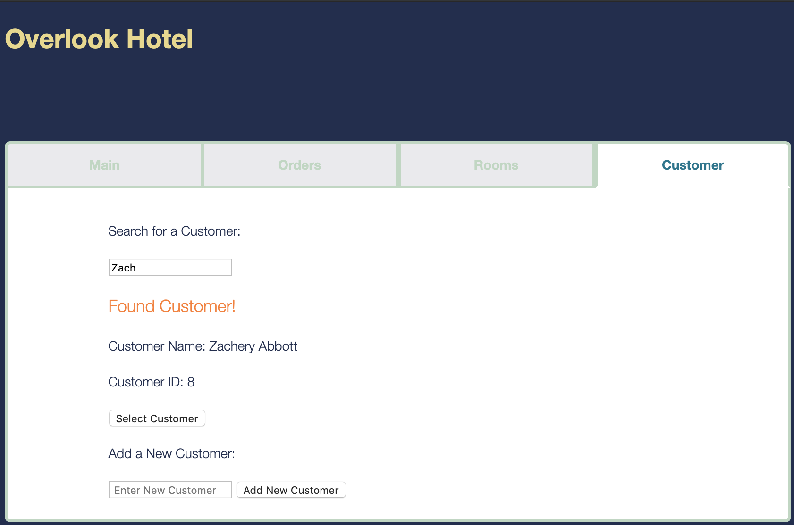
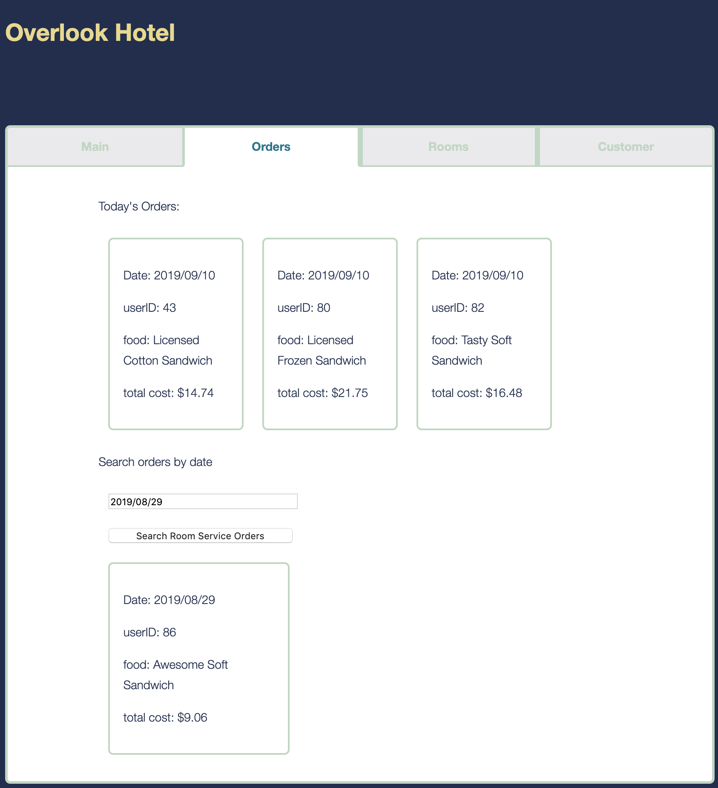
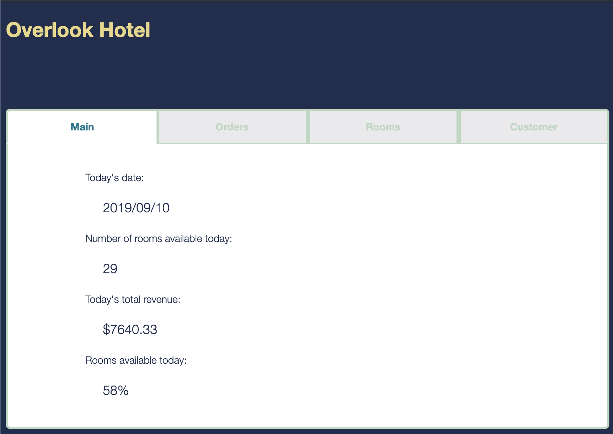
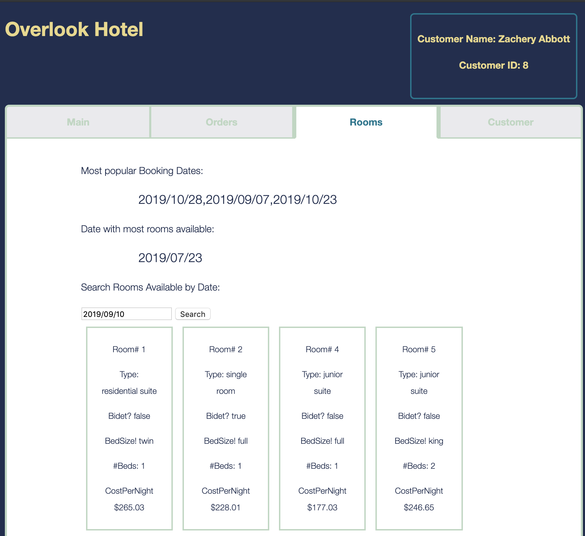

# Overlook Hotel
## By: Michael Schneider

Check out the live site<a href=https://mschneider247.github.io/overlook> here </a> on Github!

## Abstract

An app based around organizing a hotel's data for the Manager.  The manager can quickly see all relevant information for the day as well as search and add guests.

## Install/Setup

Clone this repo to your local computer:``` $ git clone https://github.com/mschneider247/overlook.git ```

Run ``` $ npm install ``` in your terminal

To open the game run ``` $ npm start ```

Copy ``` http://localhost:8080/ ``` and paste it into a browser tab, have fun!

## Images/Screen Shots




